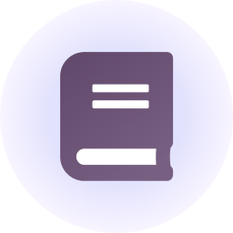

<div align="center">
    
    <h1>Docsendara Engine</h1>
    <p>
        
        
        <a href="./LICENSE"></a>
    </p>
</div>

## 🔗 About

Docsendara is a modern, fully open-source documentation engine built with Next.js. It fetches, renders, and manages documentation content directly from GitHub, making it easy to build beautiful, interactive docs for your project or product.

- **Next.js-based:** Docsendara is a complete Next.js application. You can use it as a standalone documentation site, or copy just the core engine files into your own Next.js project for seamless integration.
- **Flexible Integration:** Use Docsendara as a ready-to-deploy docs site, or embed its components into your own Next.js app.
- **Automatic GitHub Sync:** Docs content, authors, and contributors are managed via GitHub, so your documentation always stays up-to-date with your codebase.

## 🧩 Integration Options

- **Full Project:** Deploy Docsendara as a standalone documentation site. Just clone, configure, and deploy.
- **Documentation Engine:** Copy the contents of the `template/blank` directory into into a page directory already set in your Next.js project. So for instance if you had a Next.js project and want to add documentation to it, you could copy the contents of the `template/blank` directory into a new directory called `docs` in your project like `src/app/docs`.

## ✨ Features
- **GitHub integration**: Fetch docs and metadata directly from your GitHub repo
- **Markdown rendering**: Supports rich Markdown with custom styling
- **Customizable sidebar**: Organize docs with categories, icons, and custom ordering
- **Author & contributor credits**: Show authors/contributors for each page
- **Responsive design**: Looks great on any device
- **Easy deployment**: Deploy to Vercel, Netlify, or any Next.js-compatible host

---

## 🚀 Quick Start

1. **Clone the repo**
   ```sh
   git clone https://github.com/t-a-g-o/docsendara.git
   cd docsendara
   ```
2. **Install dependencies**
   ```sh
   npm install
   # or
   yarn install
   ```
3. **Configure your docs**
   - Edit `src/app/utils/docsConfig.js` to set your GitHub repo, sidebar structure, and metadata.
   - Add your GitHub token to `.env` if needed:
     ```env
     NEXT_PUBLIC_GITHUB_TOKEN=your_token_here
     ```
4. **Run locally**
   ```sh
   npm run dev
   # or
   yarn dev
   ```
   Visit [http://localhost:3000](http://localhost:3000)

---

## 🌍 Deployment
- **Vercel**: See [`documentation/integration/vercel.md`](documentation/integration/vercel.md)
- **Netlify**: See [`documentation/integration/netlify.md`](documentation/integration/netlify.md)

---

## ⚙️ Configuration
- **Sidebar & Pages**: Edit `src/app/utils/docsConfig.js` to organize your docs and set per-page metadata.
- **Styling**: Customize colors, fonts, and more in `src/app/utils/styleConfig.js`.
- **Authors & Contributors**: See [`documentation/getting-started/authors-contributors.md`](documentation/getting-started/authors-contributors.md)

---

## 🤝 Contributing
Pull requests are welcome! If you have ideas or improvements, open an issue or submit a PR.

---

## 📲 Support & Feedback
Found a bug or have a suggestion?
- [Open an issue](https://github.com/t-a-g-o/docsendara/issues)

---

## 📝 License

Licensed under the [MIT License](./LICENSE) - 2025 tagoWorks

### Get in Touch
- Email: [santiago@tago.works](mailto:santiago@tago.works)
- Website: [tago.works](https://tago.works)
- Discord: [Join our community](https://ascendara.app/discord)
